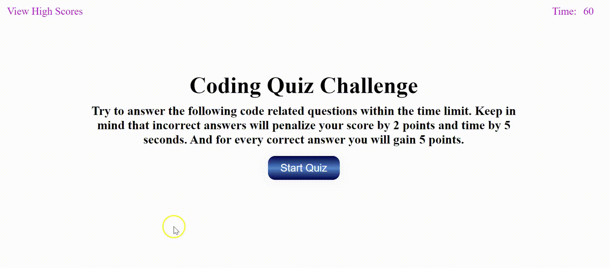

# Code-Quiz

[](https://opensource.org/licenses/MIT)

## Description
An interesting code quiz with brain teasing questions on programming concepts.

## Instructions
1. The timer starts when you click on the Start Quiz button.
2. Once you start the quiz, a question will be displayed with 4 buttons.
3. Click on the button to choose an answer.
4. Once you answer the question, a message will be displayed showing whether your answer was correct or wrong and next question will appear.
5. Once the timer runs out or you answer all the questions, you will reach the end of the quiz.
6. In the end page, your score will be displayed. Here you can enter your initials and click submit to save your score.
7. To view your score again, click on View High Score at the top left corner of the page.
8. To go back to the main page click on Go Back button and to clear the score click on Clear High Score button.

Note : For every wrong answer, you lose 2 points and 10 seconds on the timer.
       For every right answer, you gain 5 points.

## Website
https://deepikabekal.github.io/Code-Quiz/

## Screenshot



## Technologies Used
* HTML
* CSS
* Javascript
* jQuery
* Web API - DOM

## Contact Info
If any queries please send me an email at deepika.bekal2@gmail.com

## User Story
```
AS A coding boot camp student
I WANT to take a timed quiz on JavaScript fundamentals that stores high scores
SO THAT I can gauge my progress compared to my peers
```

## Acceptance Criteria
```
GIVEN I am taking a code quiz
WHEN I click the start button
THEN a timer starts and I am presented with a question
WHEN I answer a question
THEN I am presented with another question
WHEN I answer a question incorrectly
THEN time is subtracted from the clock
WHEN all questions are answered or the timer reaches 0
THEN the game is over
WHEN the game is over
THEN I can save my initials and score
```

## References
* Study Material for HTML, CSS, javascript and Web API provided by Trilogy Education Services.
* www.w3schools.com
* https://developer.mozilla.org/en-US/docs/
* Javascript and JQuery book by Jon Duckett
* https://javascript-workbook.netlify.app/
* www.stackoverflow.com
* Button styles inspired by https://gradientbuttons.colorion.co/
